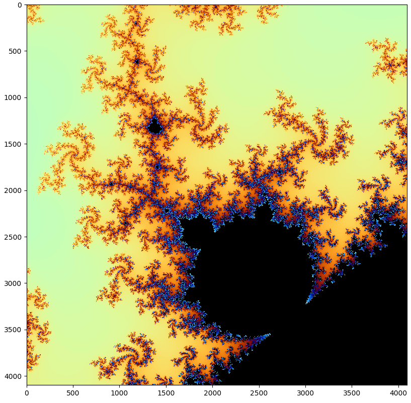

# TinyFPGA BX Mandelbrot Generator
I'm two days into learning Verilog - this is a small demo I wrote that generates images of the Mandelbrot set.

The FPGA communicates with the host PC via a serial port. In my setup this is the bottleneck, as my serial adapters don't work properly at baud rates over 500kbaud. If you have a better adapter, you could run the UART at 4Mbaud, maybe higher.

### How to run it
- use apio to compile the verilog files and upload the configuration to your TinyFPGA BX
- connect a serial adapter to the board (PIN_12 = TX, PIN_13 = RX)
- change the serial port in `mdbr_read_image.py` to match your port
- run `mdbr_read_image.py`

calculating the image can take quite a while, as the FPGA has to send a byte over the UART for every pixel. For a 4096² pixel image like the one below, this takes about 5 minutes at 500kbaud.

### Internals
The code uses fixed point arithmetic with a maximum of 24 fractional bits. It does a maximum of 255 iterations, though this is user configurable. Images are processed in blocks of 64x64 pixels. The python script sends the xy coordinates of the bottom left pixel
and the step size per pixel, the FPGA responds with 4096 bytes that contain the number of iterations for every pixel.

### IP cores used
This code uses two IP cores from opencores.org:
- [Fixed Point Math Library for Verilog](https://opencores.org/projects/verilog_fixed_point_math_library)
- [SSP_UART](https://opencores.org/projects/ssp_uart)
